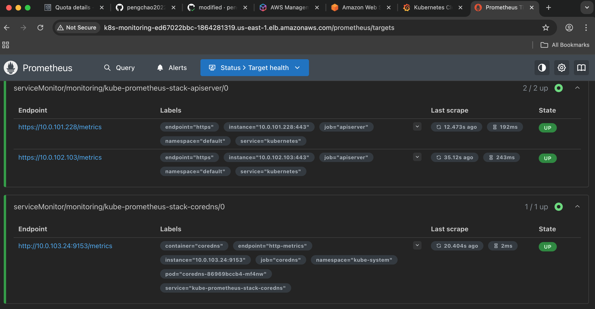

# Monitoring-Prometheus-Grafana-AWS-EKS

In this Demo, I will deploy promethes and grafana for the monitoring system on AWS EKS, All the EKS pods and EKS nodes will be under the monitoring in this system

## Features

- Deploy Prometheus and Grafana using Helm

- Helm install kube-prometheus-stacks and the grafana and prometheus pods will be created

- with node-exporter using a daemonset deplyment , the node which be labeled with "monitoring" will 

  install the node-exporter

- all the EKS pods including pods from kube-system will be monitored

- Github actions CI/CD with necessary secrets deploy the monitoring system to AWS EKS 

- Grafana ingress , Prometheus ingress , alertmanager ingress with AWS ALB for the internet facing access

- Grafana with PVC for a persistent storage so that your Dashboards in grafana won't disappear when you re-depploy on Github actions

## Usage

- you can fork or clone to your computer

```shell
git clone https://github.com/pengchao2022/monitoring-prometheus-grafana-aws-eks.git 

```

- you need to setup the following variables in your github secrets:

    - AWS_ACCESS_KEY_ID
    - AWS_SECRET_ACCESS_KEY
    - EKS_CLUSTER_NAME
    - AWS_REGION
    - GRAFANA_ADMIN_USER
    - GRAFANA_ADMIN_PASSWORD

- Your EKS cluster will also need ebs-csi driver controller installed and alb-ingress-controller installed

## Reference

- You need to have the following pods running on your monitoring namesapce


- Here's Grafana for EKS Cluster activities


- Here's Prometheus targets display




## Notice

- Please be sure to use the PVC in grafana specially for a CICD process.

- Written be Pengchao Ma 2025